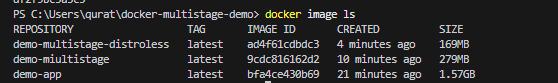

# Docker Multi-Stage & Distroless Demo

## 🚀 Overview
This project demonstrates:
- Basic Docker container
- Multi-stage builds
- Distroless containers

## 📦 Image Size Comparison
| Type        | Size   |
|------------|--------|
| Basic Node | 1.5GB  |
| Multi-stage| 279MB  |
| Distroless | 169MB  |

## 🧠 Key Concepts

### Multi-Stage Builds
- Reduce image size
- Separate build and runtime

### Distroless
- Minimal image
- No shell
- Better security

## ▶️ How to Run

### Build basic
docker build -t demo .

### Run
docker run -p 3000:3000 demo

### Multi-stage
docker build -f Dockerfile.multistage -t demo-multi .

### Distroless
docker build -f Dockerfile.distroless -t demo-distroless .

## 📌 Learning Outcome
- Optimized Docker images
- Improved container security
- Hands-on DevOps fundamentals

## 📸 Docker Images Output

